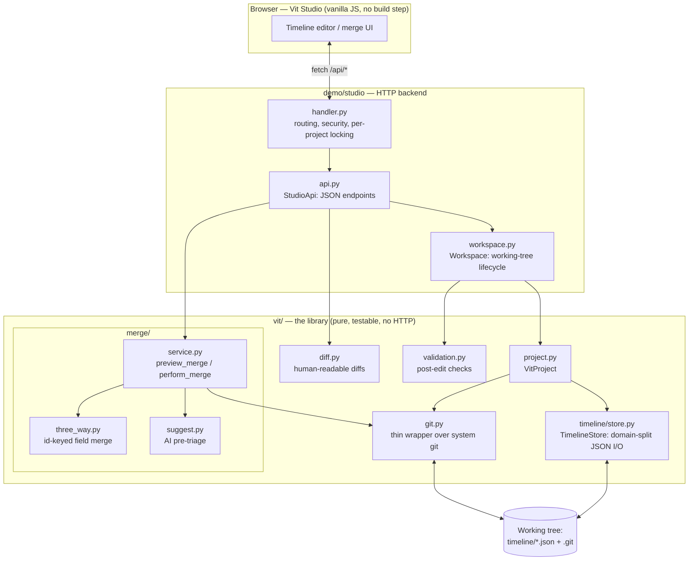
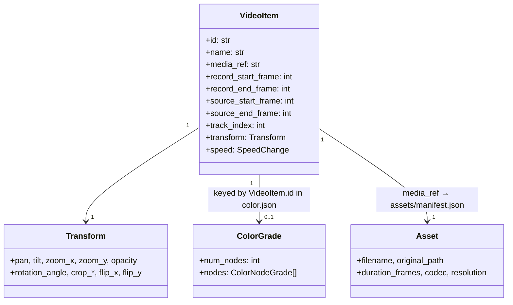
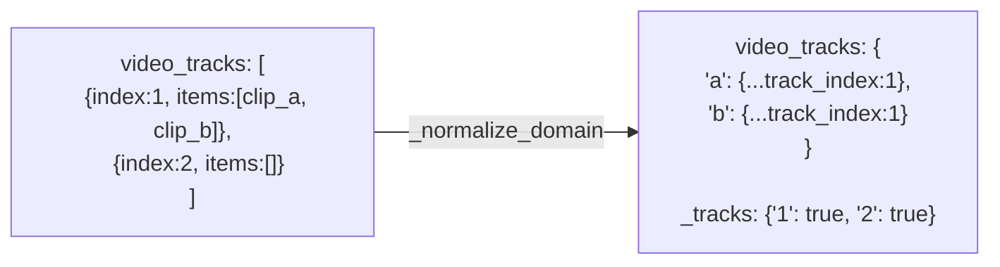
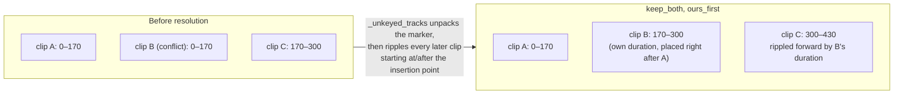
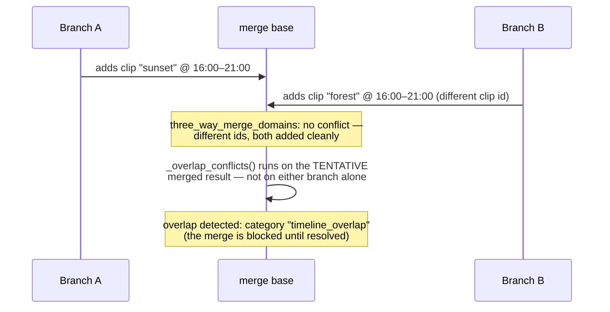
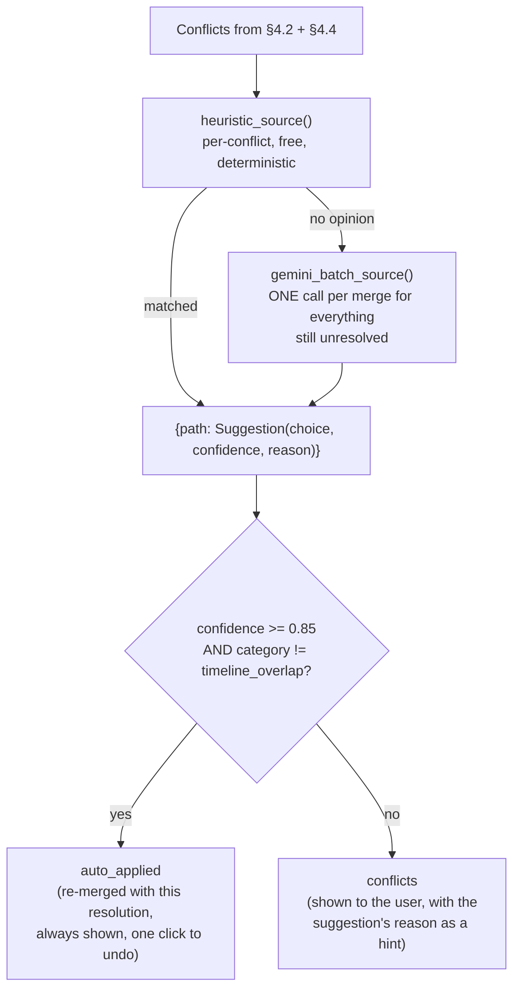
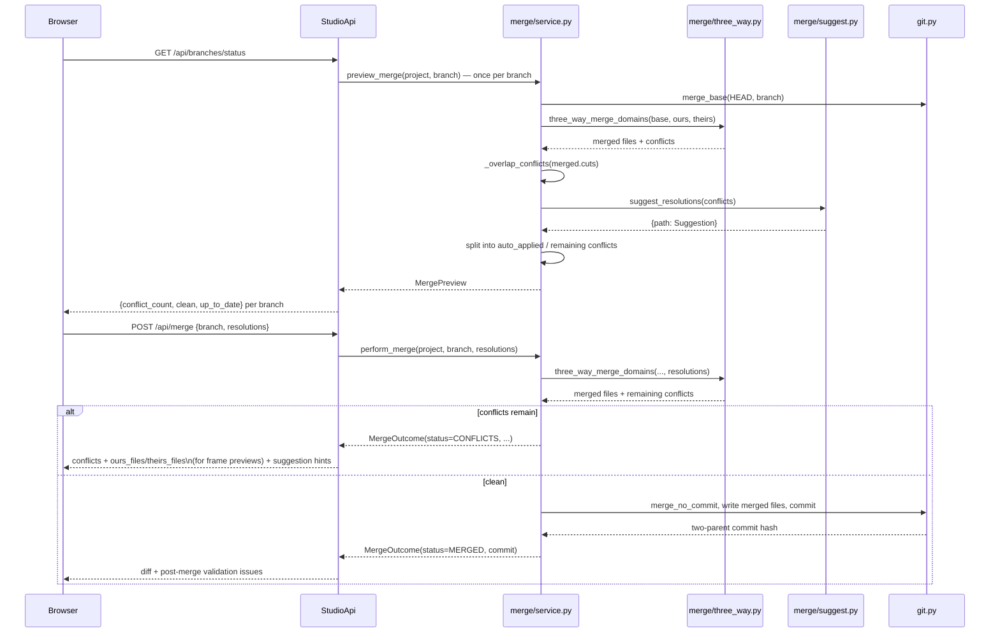
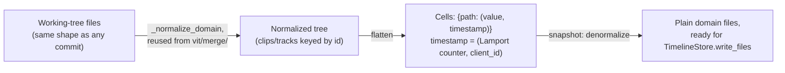
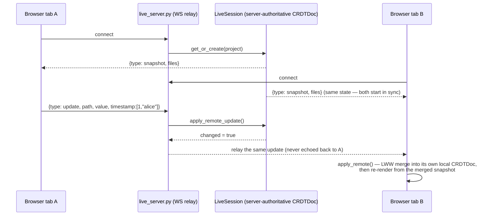

# Architecture

This document covers, in order: the problem in more depth, the system's
components, the on-disk data model, the merge algorithm (the core of the
project), and how a request flows through the Studio backend.

## 1. Why a normal git merge doesn't work here

A video timeline, reduced to its structural essence, is a list of clips per
track, each with a start/end position, a source reference, and a pile of
per-clip properties (transform, color, speed, effects). Two editors on two
branches each touch some subset of that structure.

Represent the whole timeline as one JSON file and hand it to git, and two
completely independent edits — one editor trims clip A, another adds clip B
somewhere else entirely — will very often land near each other in the
serialized text (arrays reformat, keys shift), producing a **text conflict**
even though nothing about the edits themselves actually conflicts. The
alternative failure mode is a tool that "helpfully" auto-merges by picking
one side's file wholesale, which silently discards the other editor's work.

Neither is acceptable for real collaborative editing. The fix isn't a better
diff algorithm for JSON text — it's not treating the timeline as text at all.

## 2. Component overview



**Layering rule**: `vit/` never imports from `demo/`, and knows nothing about
HTTP. `demo/studio/` is a thin transport + workspace-lifecycle layer on top
— every merge decision, every diff line, every validation rule lives in
`vit/` and is testable with no server running at all (see `tests/`, which
imports `vit/` directly for the majority of its coverage).

## 3. Data model

### On-disk layout

```
my-project/
├── .git/                  real git repository
├── .vit/config.json
├── timeline/
│   ├── cuts.json             video tracks + clips (position, transform, speed)
│   ├── color.json             per-clip color grades, keyed by clip id
│   ├── audio.json             audio tracks + clips
│   ├── effects.json           per-clip effects, keyed by clip id
│   ├── markers.json           timeline markers
│   └── metadata.json          project/timeline name, fps, resolution
└── assets/
    └── manifest.json         media metadata (never the media bytes themselves)
```

Splitting by **domain** (not by track, not by clip) is the first-level
decoupling: a color grade and a trim never contend for the same file, so a
huge class of "conflicts" never reaches vit's own merge logic at all — git's
own file-level merge already resolves them for free.

Every domain file is written with `indent=2, sort_keys=True` and a trailing
newline (`vit/timeline/store.py::write_json`). Byte-identical state always
produces byte-identical files, which is what keeps git diffs minimal instead
of full-file rewrites on every save.

### Clip identity



Every mergeable entity — a clip, a track, a color grade, a marker — has a
**stable id that never changes for its lifetime**, independent of its
position in any array. This is the single design decision the whole merge
algorithm rests on: position-based matching is what makes text merges
conflict on unrelated edits; id-based matching is what lets `vit/merge/`
match "the same clip" across three different versions of the timeline and
merge it field by field.

## 4. The merge algorithm

This is the core of the project. `vit/merge/three_way.py` runs entirely in
memory on plain dicts — no git, no disk — which is what makes it exhaustively
unit-testable (`tests/test_merge_three_way.py`).

### 4.1 Normalize: arrays → dicts keyed by stable id



Clips are flattened out of their track array into one dict keyed by clip id
(the track index moves onto the clip itself as a field). **Track existence**
is captured as its own id-keyed structure (`_tracks`) — this is what lets a
track *deletion* merge correctly (§4.4) instead of being decided by a
"whichever branch has more tracks" count comparison.

### 4.2 Recursive three-way merge over the normalized tree

```mermaid
flowchart TD
    Start(["_merge_value(base, ours, theirs, path)"]) --> KeepBoth{"resolution at this path\nis op: keep_both?"}
    KeepBoth -->|yes, both sides still dicts| ResolveKB["split into two adjacent clips\n(consumed later by denormalize)"]
    KeepBoth -->|no| Eq1{"ours == theirs?"}
    Eq1 -->|yes| ReturnOurs1["return ours\n(no divergence)"]
    Eq1 -->|no| Eq2{"ours == base?"}
    Eq2 -->|yes| ReturnTheirs["return theirs\n(only theirs changed)"]
    Eq2 -->|no| Eq3{"theirs == base?"}
    Eq3 -->|yes| ReturnOurs2["return ours\n(only ours changed)"]
    Eq3 -->|no| BothDicts{"both sides are dicts?"}
    BothDicts -->|yes| Recurse["recurse per key:\nunion of base/ours/theirs keys,\n_merge_value on each"]
    BothDicts -->|no — a leaf field genuinely diverged| Resolution{"resolution supplied\nfor this path?"}
    Resolution -->|"value": override| ReturnValue["return the override value"]
    Resolution -->|"ours" / "theirs"| ReturnChoice["return the chosen side"]
    Resolution -->|none| Conflict["report Conflict\n{path, domain, base, ours, theirs}\n(keeps 'ours' until resolved)"]
```

The recursion is the whole trick: at every level, if only one side actually
changed from the common ancestor, that side's value wins **with no
conflict** — this is what makes two edits to two different clips, or two
different fields of one clip, combine automatically. A conflict is only
raised at a genuine leaf where *both* sides changed the *same* value to
*different* things.

### 4.3 Denormalize: dicts → arrays, with the "keep both" ripple

If a conflict was resolved with `{"op": "keep_both", "order": "ours_first"}`,
`_merge_value` doesn't return a plain value — it returns a marker holding
both clips. `_unkeyed_tracks` (the inverse of §4.1) is the one place that
already walks a track's items in position order, so it's where that marker
gets unpacked:



Every clip on the same track that starts at or after the insertion point
shifts forward by exactly the inserted clip's duration — nothing overlaps.
Downstream audio isn't rippled by this pass (out of scope for a video-track
merge), so `vit/validation.py`'s sync check reliably catches and surfaces
that afterward rather than leaving it silently wrong.

### 4.4 What id-matching still can't see: timeline overlap

Two branches each independently *adding a new, different clip id* to the
same time range of the same track never touches the same key — `_merge_value`
sees two clean additions and lets both through. That's correct per-clip
behavior and exactly why it's blind to the overlap:



`vit/merge/service.py::_overlap_conflicts` runs a second pass — after the
field-level merge, on the merged result — using the same pair-finding logic
`validation.py` already uses for post-edit checks (`_find_overlapping_pairs`,
extracted once so there's a single definition of "overlap," not two that
could drift apart). Four resolutions are offered: keep one clip, or keep
both (back-to-back with the same ripple as §4.3, or moved to a new track).

### 4.5 Pre-triage: reducing decision load without deciding silently



The category check in the gate is a **structural** safeguard, not a
convention any individual suggestion source has to remember to honor:
`timeline_overlap` conflicts never auto-apply regardless of what confidence
any source — including the network-backed one — reports, because
`keep_both`'s ripple is too large a silent side effect for a threshold alone
to gate safely. The Gemini source itself also never even sees overlap
conflicts (filtered out before the prompt is built) — belt and suspenders.

The LLM call is a **single batched request per merge**, not one call per
conflict, and fails soft end to end: no API key, a network error, or a
malformed response all just mean the batch source contributes nothing —
the deterministic heuristic alone is a complete, functioning pre-triage, so
a model outage degrades suggestions, it never blocks a merge.

## 5. Request flow: a merge, end to end



Every request is serialized through a **per-project lock**
(`demo/studio/handler.py::_lock_for`) keyed by project path — concurrent
requests to the same project's git working tree never race, but (once
multi-project routing exists) different projects never block each other
either, including a slow multi-branch `/api/branches/status` call.

## 6. Live co-editing: a small CRDT instead of a heavy dependency

Everything in §1–§5 concerns *committed history* — branches, merges,
conflicts. Live co-editing is a different problem: two browser tabs looking
at the *same uncommitted timeline* at the same moment, before anyone has
saved anything. It's an additive layer (`vit/live/`) that never touches
`vit/merge/`, `vit/git.py`, or `vit/diff.py` — its only contact with the rest
of the library is writing through `TimelineStore.write_files()` and
`VitProject.commit_if_changed()` on an explicit save, exactly like a single
editor's save works today.

### Why not Yjs

The obvious choice for browser CRDT sync is Yjs, via a Python binding
(`y-py`/`pycrdt`). Both are Rust-backed with no prebuilt wheel for every
platform this project might build on, and neither was installed here — pulling
one in would mean a compiler-dependent build step for a demo project with no
dependency manifest to begin with. Since this project already controls both
ends of the wire (a Python backend, a build-step-free vanilla-JS frontend),
it doesn't need a general-purpose CRDT library — it needs *one* correctly
implemented CRDT for *one* known document shape, which is a much smaller,
fully auditable problem.

### The CRDT: Lamport-clock LWW-registers over vit's own normalized shape

`vit/live/crdt.py` flattens the same normalized representation
`vit.merge.three_way._normalize_domain` already produces (clips/tracks keyed
by stable id, not array position) into independent cells, each holding
`(value, timestamp)`. A cell is a plain **LWW-Register** — `merge(a, b) = a
if a.timestamp >= b.timestamp else b` — which is commutative, associative
and idempotent, the three properties a CRDT needs. The whole document is the
product of these cells, merged independently; a product of CRDTs is a CRDT.



Timestamps are **Lamport clocks**, not wall-clock: a local edit increments
the local counter; a received remote update advances the local counter to
`max(local, remote)`. Ordering only depends on causality, never on clock
skew between two laptops. `client_id` breaks ties on equal counters.
Deletion is **delete-wins**: removing an item writes a dedicated `__exists__`
tombstone cell (LWW like everything else), and a snapshot excludes anything
under a tombstone regardless of a field edit with an even later timestamp
that never saw the delete — a deliberate, documented simplification, not the
only possible policy.



Each browser tab keeps its **own** replica of the CRDT (mirrored in
`demo/static/js/live.js`, field-for-field identical algorithm to the Python
side) rather than blindly trusting every relayed message — the server relays
messages that changed *its* state, but each client still runs the same LWW
comparison on receipt, so a client's own optimistic local edit that actually
lost to a genuinely concurrent edit gets corrected the same way every other
client converges.

### Verifying convergence without a browser

CRDT convergence is a property of data, not of pixels — it doesn't need a
browser to prove. Three layers of real (non-mocked) verification exist:

1. **`tests/test_live_crdt.py`** — pure Python, no I/O: feeds the same set of
   concurrent updates to independent `CRDTDoc` instances in every possible
   delivery order and asserts they all converge to one identical state.
2. **`tests/test_live_integration.py`** — starts the *actual*
   `demo/studio/live_server.py` code as a real asyncio server, opens real
   `websockets` client connections (simulating browser tabs), and proves
   convergence over an actual socket, then proves an explicit save produces
   a real git commit.
3. **`tests/live/test_live_crdt.node.js`** — the same convergence proofs as
   (1), run with Node's built-in test runner directly against the *shipped*
   `demo/static/js/live.js` file (it's dual-mode: pure data functions
   `require()`-able from Node, browser wiring guarded separately) — proving
   the frontend implementation, not just a description of it, actually
   converges too.

What none of this proves: that clicking two things in two real browser tabs
looks right on screen. No browser tool was available while building this —
the DOM-level rendering path (`applyRemoteSnapshot` → `render()` in
`live.js`) is wired following the exact same call already used for every
other state change, but hasn't been visually confirmed.

### A real deployment constraint

The relay runs on a **second port** (`demo/studio/live_server.py`), because
plain `http.server` — what the rest of the Studio runs on — can't speak
WebSocket on the same port. `docker-compose.yml` publishes both `8765` and
`8766`, so this works locally and in Docker. It will **not** work unmodified
on a PaaS that only forwards a single public port to a container (Render's
free tier, notably) — the WebSocket port would be unreachable from outside
even though the main HTTP port works fine. Fixing that for real means either
running everything through an ASGI server that can multiplex both HTTP and
WebSocket on one port, or a reverse proxy in front that does — out of scope
for what's built here, and flagged rather than silently left to fail.

## 7. Testing strategy

The merge algorithm, diff formatting, and validation rules are pure
functions over plain dicts — tested directly with no git repo, no HTTP
server, no filesystem (`tests/test_merge_three_way.py`,
`tests/test_diff.py`, `tests/test_validation.py`). One layer up,
`tests/test_merge_service.py` and `tests/test_merge_overlap.py` exercise
the same logic against a real temporary git repository, proving the
git-integration boundary itself (real commits, real branches, real
`merge-tree` conflict detection) matches what the pure-function tests
already established. `tests/test_studio.py` and
`tests/test_studio_handler_locking.py` cover the HTTP/workspace layer on
top of that. Live co-editing has its own three-layer verification described
in §6. See `docs/JSON_SCHEMAS.md` for the on-disk schema reference.
